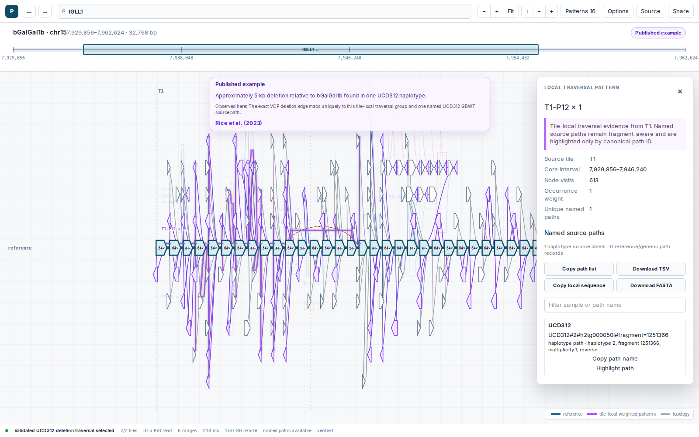
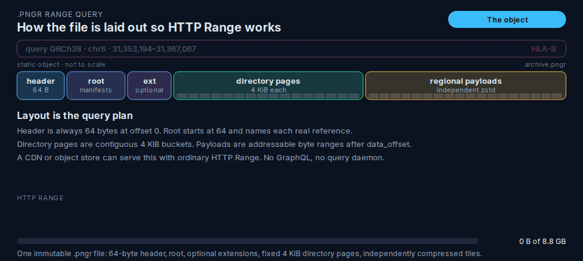

# pangenome-range

[](https://github.com/a-r-d/pangenome-range/actions/workflows/ci.yml)
[](https://www.npmjs.com/package/pangenome-range)
[](LICENSE)

## Why I built this

This started with recent work I did on
[PureJsImage](https://github.com/a-r-d/PureJsImage), using HTTP range requests to
open large TIFF files on [purejsimage.com](https://purejsimage.com/) without
downloading the whole image first.

I wanted to find another interesting problem for the same approach. Pangenome
graphs were a good fit: the files are huge, but a browser usually needs only one
small region. This project is the result.

**This repository records a short experiment in constraint-driven agentic
development on a scientific domain I did not know beforehand.** A real continuation would need first-class snarl semantics, exact
coordinate interoperability across fragmented references, a JBrowse adapter,
and sustained validation with domain experts and more corpora. I am publishing
the code and evidence as a completed research artifact; **I do not plan to
maintain it as an ongoing product**.


[DEMO! chicken pangenome →](https://a-r-d.github.io/pangenome-range/demo?archive=chicken&preset=chicken-igll1-ucd312-deletion)



This view comes from a **1.50 GB chicken pangenome**. The browser fetched just
**120.7 KB in 10 requests** to show the IGLL1 region and a published 5,184-base
deletion.

## What is in this repository

There are four main pieces:

- **The `.pngr` file format** stores a graph so small regions can be fetched on
  demand.
- **A Rust encoder** converts GBZ graphs into `.pngr` files.
- **A TypeScript reader** opens local or remote archives and returns graph data.
- **A browser viewer** draws the selected region and its local paths.

## How a range query works



A region query is three dependent HTTP rounds against one static file:

1. **Bootstrap** — 16 KiB from offset 0 covers the `PNGRNG01` header and root. The root names each real reference and where its directory pages live.
2. **Directory** — coordinates map to a 4 KiB page, `page = first + floor((start − grid) / bucket) × 4096`. That page lists payload offsets, lengths, and BLAKE3-128.
3. **Payloads** — selected tiles are fetched in parallel, decompressed independently, and decoded. The rest of the object is never read.

On the published HPRC demo this is typically 5 range requests and about 74 KB
of a 10.84 GB archive. [Interactive
version](https://a-r-d.github.io/pangenome-range/how-range-reads-work).

## Result against range-readable GBZ-base

It's well known that you can use HTTP Range reads with remote hosted SQLite databases. But, is this actually an optimal format?

We tried to benchmark this scenario using a GBZ-base formatted db file vs our `.pngr` format.

This benchmark used the complete 5.49 GB HPRC v2.1 graph and the same
47 fixed-seed intervals against three immutable objects: the untouched 10.05 GB
GBZ-base SQLite database, a 10.052 GB range-tuned copy with one composite path
index, and the 10.84 GB `.pngr`. The SQLite runs use the unchanged upstream
`Subgraph::from_db` query through a strict read-only HTTP Range VFS. Every cold
query starts with a fresh connection, HTTP client, and byte-bounded cache.

The table compares transport work, not local-disk time with WAN time. SQLite is
shown at its measured 64 KiB request/overfetch tradeoff; `.pngr` is the retained
public no-store WASM run.

| Random interval | tuned SQLite requests / bytes p50 | `.pngr` requests / bytes p50 |
| --- | ---: | ---: |
| 1 kb | 14 / 852.0 KB | 2 / 25.8 KB |
| 10 kb | 15 / 917.5 KB | 2 / 46.1 KB |
| 100 kb | 20 / 1.25 MB | 2 / 196.4 KB |
| 1 Mb | 64 / 4.13 MB | 2 / 1.57 MB |

Across all 47 cold queries, range-tuned SQLite required **1,249 HTTP requests
and 78.8 MB**. `.pngr` required **94 requests and 18.6 MB**: 13.3x fewer
requests and 4.23x fewer transferred bytes. The untouched upstream database was
much worse at 40,801 requests and 166.9 MB because its path lookup scans the
`Paths` table. The 1.89 MB composite index removes that avoidable handicap;
the remaining SQLite page walk is the fairer comparison.

The result is still mixed. `.pngr` is 7.8% larger than GBZ-base, and local
GBZ-base remains faster for small queries. The SQLite VFS workload here ran
through the strict loopback Range origin, so its request and byte counts are
real but its timing is not presented as public-network timing. Publishing the
HPRC-derived databases for the matching public-route latency run requires
separate data-egress approval. All 47 HTTP-SQLite outputs matched retained
source-GBZ JSON hashes; all 47 `.pngr` regions and 730 selected haplotype tiles
passed their declared source oracle. [Full result](results/2026-08-31-hprc-public-network-gbz-base/REPORT.md).


## More demos!

| Demo | Data | What it shows |
| --- | --- | --- |
| [Chicken IGLL1](https://a-r-d.github.io/pangenome-range/demo?archive=chicken&preset=chicken-igll1-ucd312-deletion) | 1.50 GB chicken graph | A published deletion and the named source paths that contain it |
| [HPRC HLA-B](https://a-r-d.github.io/pangenome-range/demo?archive=hprc&locus=HLA-B&zoom=0.32&center=0.5&vscale=1.3) | 10.84 GB human graph | Human variation, gene search, and named source paths |
| [Rice Xa7](https://a-r-d.github.io/pangenome-range/demo?archive=rice&locus=Xa7&zoom=2.856&center=0.600576&vscale=1.45) | Rice chromosome 6 | A crop pangenome and gene search |
| [1000G NA19239](https://a-r-d.github.io/pangenome-range/demo?archive=1000g&sample=NA19239&contig=1&start=0&end=32768&zoom=0.35&center=0.5&vscale=1) | Whole population graph | One sample in a large human population graph |

<details>
<summary>What the chicken example checks</summary>

The archive comes from the published 30-assembly chicken pangenome. The selected
traversal is present on one UCD312 haplotype, whose exact GBWT path identifier is
`UCD312#2#h2tg000050l#fragment=1251366`.

That identifies the source path; it does not by itself establish a phenotype,
breed, ancestry, or allele frequency. [How the chicken example was
checked](docs/CHICKEN_DEMO.md).

</details>

<details>
<summary>More HPRC examples</summary>

- [MICB — MHC class I-related variation](https://a-r-d.github.io/pangenome-range/demo?archive=hprc&locus=MICB&zoom=0.38&center=0.5&vscale=1.2)
- [KIR3DL1 — structurally complex immune locus](https://a-r-d.github.io/pangenome-range/demo?archive=hprc&locus=KIR3DL1&zoom=0.3&center=0.5&vscale=1.25)
- [CHAD — compact alternate paths and node labels](https://a-r-d.github.io/pangenome-range/demo?archive=hprc&locus=CHAD&zoom=0.45&center=0.5&vscale=1.2)
- [CRISP1 — dense graph and display controls](https://a-r-d.github.io/pangenome-range/demo?archive=hprc&locus=CRISP1&zoom=0.25&center=0.5&vscale=1)

</details>

Demo links can open a particular archive, gene, coordinate range, or saved view.
Local files still require you to choose the file in the browser.

## Install

Install the reader, viewer, and native command-line encoder with Node.js 24:

```bash
npm install pangenome-range
```

Run the encoder without a separate global installation:

```bash
npx pangenome-range encode input.gbz output.pngr
```

The native executable is supplied by an exact-version optional package for the
current platform. For a JavaScript-only installation, omit optional packages:

```bash
npm install --omit=optional pangenome-range
```

## Read a region in TypeScript

```ts
import { openPangenome } from "pangenome-range";

const archive = await openPangenome("https://example.org/graph.pngr");
const result = await archive.query({
  sample: "GRCh38", contig: "chr6",
  start: 31_353_194, end: 31_367_067,
});
console.log(result.graph.nodes.ids.length, result.tiles.length);
await archive.close();
```

## Encoder

```bash
pangenome-range encode input.gbz output.pngr
```

Add a searchable gene index with GFF3 annotations:

```bash
pangenome-range encode input.gbz output.pngr --annotations genes.gff3 --annotation-release v50 --annotation-assembly GRCh38.p14
```

Use `--path-membership` when the archive should preserve the real GBWT paths
behind each local traversal. This adds a path catalog and per-tile membership
data. Encoding stops with a clear error if the GBWT does not contain the path,
sample, and contig information needed to name those paths.

The encoder reads this information in bounded batches and can save it in the
source cache for later runs. It does not depend on a local `gbwt-rs` fork. Use
`--path-locate-max-lf-steps` to limit the work spent locating any one traversal.

The browser API reads the optional feature independently from graph queries:

```ts
const membership = await archive.pathMembership({
  sample: "GRCh38",
  contig: "chr6",
  start: 31_498_145,
  end: 31_511_124,
});
console.log(membership.paths, membership.tiles[0]?.groups);

const region = await archive.query({
  sample: "GRCh38",
  contig: "chr6",
  start: 31_498_145,
  end: 31_511_124,
});
const groups = await archive.tilePathMemberships(region.tiles[0]);
const sourcePath = await archive.pathById(groups[0].memberships[0].pathId);
const sourcePaths = await archive.pathsByIds(
  groups[0].memberships.map(({ pathId }) => pathId),
);

const combined = await archive.queryWithPathMembership({
  sample: "GRCh38",
  contig: "chr6",
  start: 31_498_145,
  end: 31_511_124,
});
console.log(combined.trace.graph, combined.trace.membership, combined.trace.catalog);
```

Each result has a real GBWT path ID, its metadata, and a consistent
`canonicalName` built from that metadata. GBWT does not retain the original
spelling of every input path name.

Named-path results belong to individual tiles; the reader does not pretend they
continue across tile boundaries. The unnamed weighted paths remain available when
named membership is not included. Catalog reads are deduplicated and bounded, and
the decoder accepts at most 250,000 membership records per group or tile.

## Encoder performance

Largest measured encode: HPRC v2.1 GRCh38 with GENCODE v50 genes, eight workers, on the same NVMe host.

| Measurement | Result |
| --- | ---: |
| Source GBZ | 5,492,627,216 bytes (5.115 GiB) |
| GFF3 annotations | 4,763,975,927 bytes |
| Output `.pngr` | 8,832,750,626 bytes (1.608× source) |
| Cold encode | 612.87 s, 685,992 KiB peak RSS |
| Warm reusable-cache encode | 384.08 s, 621,808 KiB peak RSS |
| Reusable source cache | 12,055,087,949 bytes |
| Prebuild, cold → warm | 118.94 s → 21.69 s |
| Correctness | 363,105/363,105 payloads; 9/9 graph and 58/58 haplotype checks |

Cold and warm modes produced byte-identical output. Only the prebuild reduction is directly attributable to cache reuse; whole-wall timing also contains normal I/O variance. [Full report](results/2026-08-26-release-hardening-v1/REPORT.md).

## Demo performance

Five fresh Chromium sessions against the [deployed demo](https://a-r-d.github.io/pangenome-range/demo) and its 8.8 GB remote archive:

| Measurement | Result |
| --- | ---: |
| HTTP Range requests | 5 |
| Archive bytes read | 73,972 bytes |
| Median page-to-region-ready | 520 ms |
| Observed range | 502–1,456 ms |

Measured August 27, 2026 over the public network; latency will vary by location and cache state.

## Encoder arguments

| Argument | Default | Meaning |
| --- | --- | --- |
| `input.gbz` | required | Source GBZ file. |
| `output.pngr` | required | New archive path; existing files are not overwritten. |
| `--sample NAME` | all | Encode one reference sample. |
| `--reference-haplotype N` | none | Explicitly use haplotype `N` of `--sample` as the real coordinate anchor when the GBWT does not tag a reference; disk source only, without persistent-cache reuse. |
| `--contig NAME` | all | Encode one reference contig. |
| `--start BP` | contig start | Start coordinate; requires `--contig`. |
| `--end BP` | contig end | End coordinate; requires `--contig`. |
| `--window-size BP` | `16384` | Base tile width. |
| `--codec NAME` | `zstd-3` | `none`, `zstd-1`, `zstd-3`, or `zstd-6`. |
| `--haplotypes MODE` | `anonymous-distinct-weighted-tile-paths` | Haplotype semantics; `distinct` is an alias. |
| `--max-uncompressed-chunk-bytes N` | `8388608` | Split tiles above this decoded-size limit. |
| `--min-window-size BP` | `1024` | Smallest adaptive tile; must not exceed `--window-size`. |
| `--threads N` | up to 8 cores | Bounded tile and compression workers. |
| `--max-queued-bytes N` | `268435456` | Raw plus compressed worker-queue memory limit. |
| `--source-access MODE` | `disk` | `disk` for bounded RAM or `loaded` for the in-memory oracle. |
| `--scratch-dir PATH` | output directory | Ephemeral disk-cache location. |
| `--source-cache PATH` | none | Reuse an authenticated persistent cache; disk mode only. |
| `--annotations PATH` | none | GFF3 file used to build named-locus search. |
| `--annotation-sample NAME` | inferred if unique | Reference sample for GFF3 coordinates; required when multiple samples are encoded. |
| `--annotation-feature-type TYPE` | `gene` | Exact GFF3 feature type; repeat to include more types. |
| `--annotation-release ID` | none | Required with `--annotations`. |
| `--annotation-assembly ID` | none | Required with `--annotations`. |
| `--reference-assembly ID` | none | Reference assembly stored in archive metadata. |
| `--dataset-title TEXT` | none | Deterministic archive title. |
| `--dataset-description TEXT` | none | Deterministic archive description. |
| `--source-uri URI` | none | Canonical source URI; local paths and `file:` URIs are rejected. |
| `--experimental-path-membership-summary PATH` | none | Prepared bounded tile-membership JSON; research only and requires the matching catalog. |
| `--experimental-path-catalog PATH` | none | Complete contiguous path-catalog NDJSON; research only and requires the matching summary. |
| `--path-membership` | off | Preserve named source-path membership from embedded GBWT DA samples; disk mode only. |
| `--path-locate-max-lf-steps N` | `8192` | Hard LF-step limit for each located traversal start. |
| `--keep-partial` | off | Keep the temporary sibling archive after failure. |
| `--progress MODE` | terminal: plain; redirected: off | `auto`, `plain`, `json`, or `off`. |
| `--progress-interval-seconds N` | `5` | Progress update interval. |
| `--max-chunks N` | none | Research guard limiting one selected reference path. |
| `--report PATH` | none | Write a JSON build report. |
| `--help`, `-h` | — | Show CLI help. |

## Reference

- [File-format v1 specification](docs/FILE_FORMAT_V1.md)
- [Architecture](docs/ARCHITECTURE.md) · [fixed-window archive](docs/FIXED_WINDOW_ARCHIVE.md) · [haplotype semantics](docs/HAPLOTYPE_SEMANTICS.md)
- [Benchmarks](docs/BENCHMARKS.md) · [optimization log](docs/OPTIMIZATION_LOG.md) · [release checklist](docs/FORMAT_RELEASE_CHECKLIST.md)
- [Viewer performance](docs/VIEWER_PERFORMANCE.md) · [actual viewer format gaps](docs/VIEWER_FORMAT_GAPS.md)
- [Architecture decisions](docs/adr/) · [distribution](docs/DISTRIBUTION.md) · [hosting](docs/HOSTING.md)

## License

[MIT](LICENSE)

## Thank you and data attribution

This project is possible because research groups made large pangenome resources openly available. Thank you to:

- The [Human Pangenome Reference Consortium](https://github.com/human-pangenomics/hpp_pangenome_resources) for the HPRC Release 2 Minigraph-Cactus v2.1 graph used by the main human demo. The HPRC Data Use Protocol applies to that source data.
- The [GENCODE project](https://www.gencodegenes.org/) for the Human Release 50 gene annotations that power named-locus search in the HPRC demo ([exact GFF3 source](https://ftp.ebi.ac.uk/pub/databases/gencode/Gencode_human/release_50/gencode.v50.annotation.gff3.gz)).
- The [1000 Genomes Project](https://www.internationalgenome.org/) and the [UCSC Computational Genomics Lab](https://cgl.gi.ucsc.edu/data/giraffe/mapping/graphs/for-NA19239/1000gplons/hs38d1/) for the 1000GPlons `hs38d1` graph used by the NA19239 demo.
- The [PPanG team at SJTU-CGM](https://cgm.sjtu.edu.cn/PPanG/) for the rice Minigraph-Cactus graphs and Xa7 locus context ([source repository](https://github.com/SJTU-CGM/PPanG), [paper](https://doi.org/10.1186/s12864-024-10302-5)).
- Rice et al. for the [30-chicken pangenome graph](https://zenodo.org/records/10018222) and its [BMC Biology article](https://doi.org/10.1186/s12915-023-01758-0). The source graph is CC BY 4.0.
- [NCBI RefSeq](https://www.ncbi.nlm.nih.gov/datasets/genome/GCF_016699485.2/) for the GRCg7b gene annotations used by the chicken demo.

The demo archives are derived, range-addressable representations. Please credit and follow the terms of the original data providers when using them; the repository's MIT license covers the `pangenome-range` software, not a replacement license for every upstream dataset.
